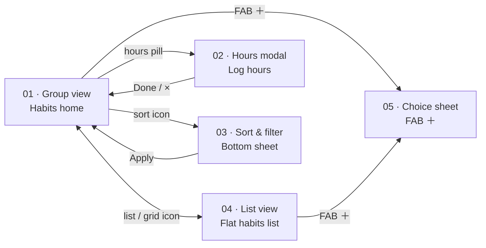

# Habits — Main Views Navigation

```mermaid
flowchart LR
  G01["01 · Group view\nHabits home"]
  G04["04 · List view\nFlat habits list"]
  M02["02 · Hours modal\nLog hours"]
  M03["03 · Sort & filter\nBottom sheet"]
  CS["05 · Choice sheet\nFAB ＋"]

  G01 <-->|"list / grid icon"| G04

  G01 -->|"hours pill"| M02
  M02 -->|"Done / ×"| G01

  G01 -->|"sort icon"| M03
  M03 -->|"Apply"| G01

  G01 -->|"FAB ＋"| CS
  G04 -->|"FAB ＋"| CS
```