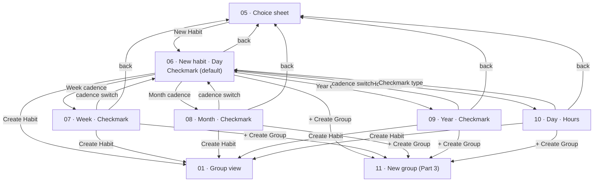

# Habits — Habit Creation Navigation

Entry point: 05 · Choice sheet → New Habit

```mermaid
flowchart TD
  CS["05 · Choice sheet"]
  H06["06 · New habit · Day\nCheckmark (default)"]
  H07["07 · Week · Checkmark"]
  H08["08 · Month · Checkmark"]
  H09["09 · Year · Checkmark"]
  H10["10 · Day · Hours"]
  G01["01 · Group view"]
  GR11["11 · New group (Part 3)"]

  CS -->|"New Habit"| H06

  H06 -->|"Week cadence"| H07
  H06 -->|"Month cadence"| H08
  H06 -->|"Year cadence"| H09
  H06 -->|"Hours type"| H10

  H07 -->|"cadence switch"| H06
  H08 -->|"cadence switch"| H06
  H09 -->|"cadence switch"| H06
  H10 -->|"Checkmark type"| H06

  H06 & H07 & H08 & H09 & H10 -->|"back"| CS
  H06 & H07 & H08 & H09 & H10 -->|"Create Habit"| G01
  H06 & H07 & H08 & H09 & H10 -->|"+ Create Group"| GR11
```