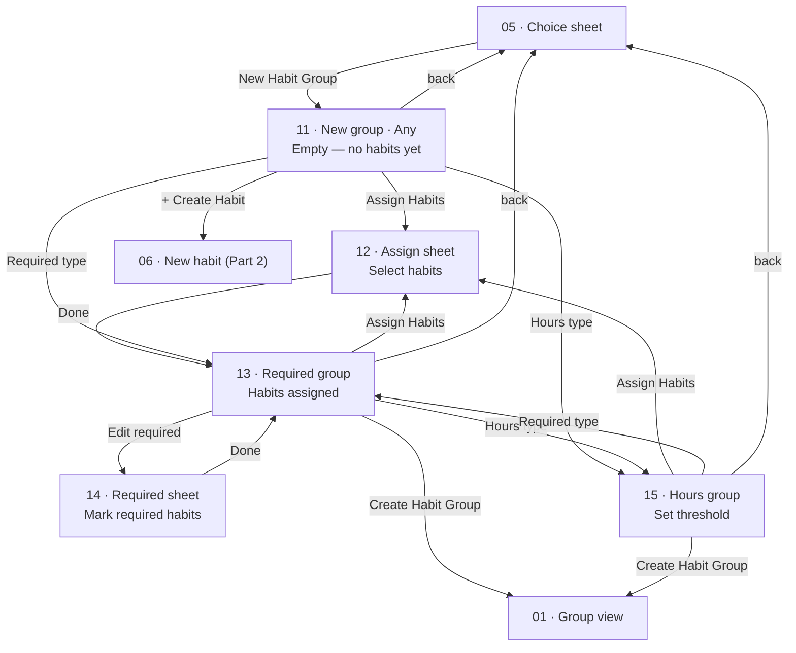

# Habits — Group Creation Navigation

Entry point: 05 · Choice sheet → New Habit Group

```mermaid
flowchart TD
  CS["05 · Choice sheet"]
  GR11["11 · New group · Any\nEmpty — no habits yet"]
  AS["12 · Assign sheet\nSelect habits"]
  GR13["13 · Required group\nHabits assigned"]
  RS["14 · Required sheet\nMark required habits"]
  GR15["15 · Hours group\nSet threshold"]
  H06["06 · New habit (Part 2)"]
  G01["01 · Group view"]

  CS -->|"New Habit Group"| GR11

  GR11 -->|"Assign Habits"| AS
  AS -->|"Done"| GR13

  GR11 -->|"Required type"| GR13
  GR11 -->|"Hours type"| GR15
  GR11 -->|"+ Create Habit"| H06
  GR11 -->|"back"| CS

  GR13 -->|"Edit required"| RS
  RS -->|"Done"| GR13
  GR13 -->|"Assign Habits"| AS
  GR13 -->|"Hours type"| GR15
  GR13 -->|"back"| CS
  GR13 -->|"Create Habit Group"| G01

  GR15 -->|"Assign Habits"| AS
  GR15 -->|"Required type"| GR13
  GR15 -->|"back"| CS
  GR15 -->|"Create Habit Group"| G01
```